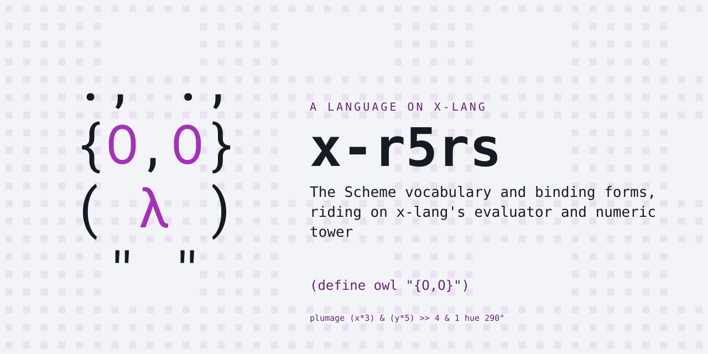
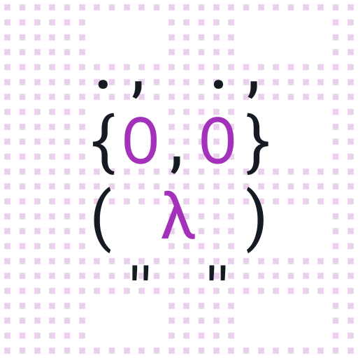

# x-r5rs — R5RS Scheme on x-lang

<p align="center"></p>

The Scheme vocabulary and binding forms, riding on
[x-lang](https://github.com/jonruttan/x-lang)'s evaluator and numeric tower.

```
$ x -l r5rs
> (define (fact n) (if (= n 0) 1 (* n (fact (- n 1)))))
> (fact 10)
3628800
> (let loop ((i 0) (acc 0)) (if (= i 5) acc (loop (+ i 1) (+ acc i))))
10
> (assoc 'b '((a 1) (b 2)))
(b 2)
```

x-r5rs is a **lang**: a surface syntax loaded over an x-lang dialect, so a
spelling shared with x-lang can mean something different here — `lambda` is one
such spelling, and `do` is the one this lang cannot claim (it dispatches on
shape instead). The terms are in x-lang's
[lang contract](https://github.com/jonruttan/x-lang/blob/main/docs/lang-contract.md).

## Status

667 specs, all green against x-lang **v0.14.0**, the release `lang.xon`
declares — about 1,500 lines of Scheme and 680 of x, across 27 spec files.

[`tests/contract/known-failures.txt`](tests/contract/known-failures.txt) is
**empty** and stays in the tree saying so: `make check` is red the moment any
spec fails, with no line there to excuse it.

Ports (R5RS §6.6) are built on the platform's `File` — open/close/read/write/
getc as syscalls, with a collector that knows about the buffers — and nothing
in that layer reaches into the base object's internal layout. Redirection and
transcripts do not shadow `display` or `write`: the platform's printer emits
through a swappable sink, so `with-output-to-file` and `transcript-on` swap
that. The bundle stays on `(dialect xe)`: an explicit `(import x/sys/file)` is
enough, because a dialect decides what is preloaded, not what is reachable
(measured both ways, `xe` and `rn` score identically).

## Install

From any directory, nothing cloned:

```bash
x --install-lang https://github.com/jonruttan/x-r5rs/releases/latest/download/lang.pin.xon
x -l r5rs
```

x fetches the published pin, then the tarball it names, verifies the digest,
and installs to `<share>/langs/r5rs`, where `x -l` looks. A failed upgrade
leaves the working install untouched.

From a clone:

```bash
make install                      # into the x on your PATH
PREFIX=$HOME/.local make install  # or a particular prefix
```

`make uninstall` removes it either way. An installed x searches
`<share>/langs/*/lang.xon`; a lang is installed when its files are there.
There is no registry.

`x` resolves langs relative to the directory it runs in. Inside an x-lang
checkout it searches `deps/langs/` only, so an installed lang is not found
there:

```
$ cd path/to/x-lang && x -l r5rs
Error: no library, app or lang named 'r5rs'
  searched lib/r5rs.x, apps/r5rs/run.x
      and deps/langs/*/lang.xon
```

Run `x` from another directory, or set `X_LANG_DIR`, which takes precedence in
both cases:

```bash
X_LANG_DIR=$HOME/.local/share/x/langs/ x -l r5rs   # the installed one
X_LANG_DIR=/path/to/x-r5rs/.. x -l r5rs            # a checkout, uninstalled
```

## Pin it for a project

An install is unversioned and machine-wide. When a project must build against
a specific version, pin it: `Pin bundle` fetches the release tarball and
verifies it against a digest before unpacking. In the project's
`lang.pin.xon`:

```x
(lang "r5rs")
(release "v0.2.3")
(bundle "sha256:…" "https://github.com/jonruttan/x-r5rs/releases/download/v0.2.3/x-r5rs-v0.2.3.tar.gz")
(source "https://github.com/jonruttan/x-r5rs.git")
```

Each release's notes carry this block with its digest, ready to paste. Then:

```x-repl
> (import x/tool/pin)
> (Pin bundle "deps/langs")
"deps/langs/r5rs-v0.2.3"
```

`deps/langs/` is where `x -l` looks in a checkout; `X_LANG_DIR` overrides it.

Install when you just want `x -l r5rs` to work. Pin when a build depends on it:
the digest is what makes the version reproducible.

**x-r7rs consumes this bundle by an exact version**: its `lang.xon` carries
`(requires-lang "r5rs" …)`, compared for equality and never parsed. A checkout
does not satisfy that row — only an install or an unpacked release tarball
carries the stamped `version` file it compares against, and that stamp is
`git describe`, so an install from a checkout not exactly on the tag reads as
`v0.2.3-1-gabc1234-dirty` and is refused by name. `--allow-lang-skew` is the
way through while working on both at once.

## Running it

```bash
x -l r5rs                  # interactive
x -l r5rs -f program.scm   # batch
```

x-lang boots the dialect `lang.xon` declares, arms this bundle's module root,
and loads `run.x` on top.

## Development

Run the specs against an x-lang checkout or install:

```bash
X=/path/to/x-lang/x.sh make test    # the suite
X=/path/to/x-lang/x.sh make check   # the suite against the contract, which CI gates on
make check-release-refs             # the declared x-lang release is named in one place
X=/path/to/x-lang/x.sh make check-if-ladders   # no new nested-if ladders
make bundle                         # roll a release tarball and print its pin
```

Pass `X` explicitly: without it the suite takes the `x` on your PATH, and an
installed x that trails the checkout reports failures the platform has already
fixed.

Do not `make install` into an x-lang checkout. The Makefile asks
`$(X) --share-dir` where to put the bundle, and a checkout answers with its own
root, so the files land in `<checkout>/langs/r5rs`, which `-l` does not search
there. The install reports success and the lang is still not found. Install
into a real `<share>` tree, or use `X_LANG_DIR`.

`make check-release-refs` keeps the versions named here as copies of the one
row in `lang.xon` from going stale; CI runs the declared release and x-lang
`main`, so a platform change that breaks this bundle shows up as a red build.

`make check-if-ladders` is the other gate, and it needs an `X`: the checker is
itself x, because a nested-`if` ladder is a shape only visible by reading the
module as s-expressions. `match` is the flat way to write a decision with more
than a couple of arms. Four arms is the threshold, and
`tools/contract/if-ladders.txt` is empty — this bundle names Scheme's
vocabulary and leaves the decisions to `r5rs/scm/*.scm`, where `cond` is flat.
The check is a ratchet in both directions.

The release tarball is byte-reproducible: it is built from the tag with
`git archive` and a timestamp-free gzip, so the same tag always yields the same
digest. Pushing a `v*` tag runs the suite and, only if it is green, publishes
the tarball, its `.sha256` and `lang.pin.xon` as a GitHub release.

## Layout

```
lang.xon               name, dialect, and the x-lang release this pairs with
run.x                  the entry point
r5rs/aliases.x         Scheme's names in x's current spellings
r5rs/prims.x           the raw platform layer
r5rs/printer.x         Scheme-style `write`
r5rs/base.x            assembles the parts
r5rs/scm/*.scm         the library, in Scheme
tests/spec-runner.sh   sources the platform's shared runner
tests/specs/*.spec.md  the suite, as literate markdown
tests/contract/        the recorded debt CI gates on -- empty, and saying so
tools/bundle.sh        rolls a release tarball and prints its pin
tools/check/           the gates: release-refs from x-lang's lang kit, and the
                       if-ladder linter, which is x because a ladder is a shape
tools/contract/        the recorded if-ladder debt -- empty, and saying so
scripts/               older harnesses, superseded by tests/ -- kept, not wired up
Makefile               install / uninstall / test / check / bundle
```

No file here carries a path literal, `run.x` included: x.sh boots the dialect
`lang.xon` declares and arms this root before `run.x` is read. CI enforces it.

## Background

Scheme began with Gerald Jay Sussman and Guy L. Steele Jr. at MIT in 1975 — a
Lisp with lexical scope, first-class continuations, and proper tail calls as a
requirement rather than an optimization. R5RS (1998, edited by Kelsey, Clinger
and Rees) is the revision this bundle implements, and the one most often meant
by "standard Scheme": famously about fifty pages, on the stated principle that
a language grows by removing the weaknesses that make features seem necessary,
not by piling features up. That brevity is why 667 specs can plausibly claim to
cover a useful core of it.

- [R5RS](https://schemers.org/Documents/Standards/R5RS/) — the report itself
- [scheme.org](https://www.scheme.org/) — the community hub: implementations, standards, SRFIs
- [SICP](https://sarabander.github.io/sicp/) — *Structure and Interpretation of Computer Programs*, the book that taught the world this language

## Licence

MIT No Attribution (MIT-0). See [LICENSE](LICENSE).

<p align="center"></p>
